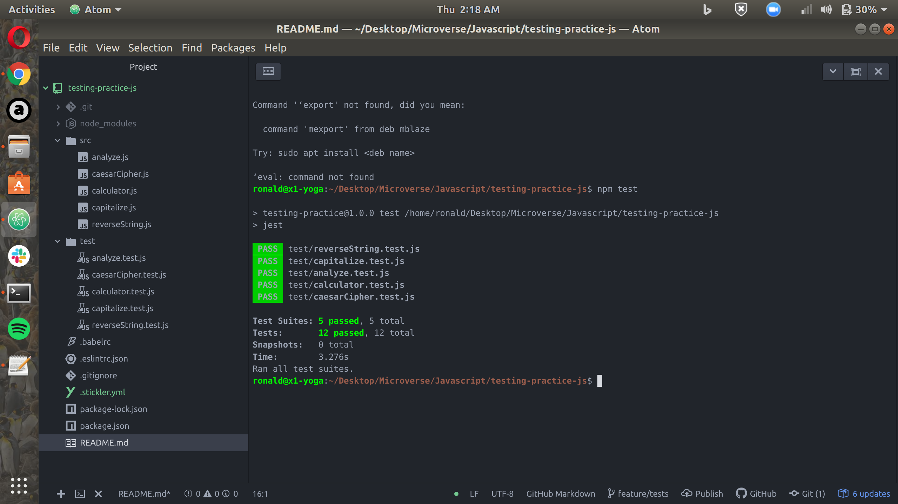

# Testing Practice
> Test driven development practice testing using Jest

## About The Project

This project introduces the concept of test driven development. We used a test runner called jest to make tests of the classes and functions we developed

### To use Project
- Clone the projects onto your local machine
- Run npm init to create a package.json file onto your machine
- Run npm i --save-dev jest to install jest as a package dependency
- Run npm run test

### Technologies used
This program was made using this technologies

- Javascript
- Jest

## Contibutors

* Leonard Rwai Kanyesigye: [Github](https://github.com/rmauritsson), [Twitter](https://twitter.com/leokanye)

* Jair Jaramillo: [Github](https://github.com/jairjy), [Twitter](https://twitter.com/jairjy)

Project Link: [https://github.com/rmauritsson/todo-list](https://github.com/rmauritsson/todo-list)

<!-- ACKNOWLEDGEMENTS -->

## Acknowledgements

* [Microverse](https://www.microverse.org/)
* [The Odin Project](https://www.theodinproject.com/)
* [W3Schools](https://www.w3schools.com/)
